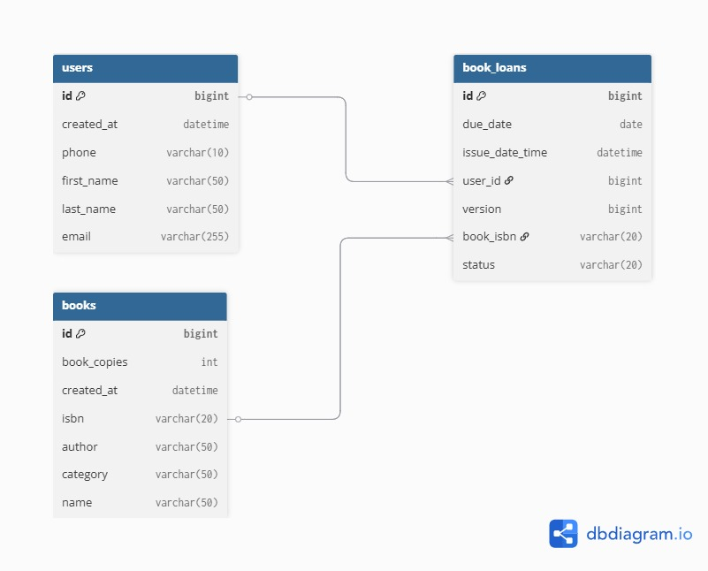

# 📚 Library Management System

This is a full-stack Library Management System built with a Java Spring Boot backend and a React frontend. The application allows users to manage books, users, and book loans.

| Component | Technology Stack |
| :--- | :--- |
| **Backend** | Java 21, Spring Boot, Maven, PostgreSQL |
| **Frontend** | React, Vite, Node.js 18+ |

---

### 💻 Live Demo (temporary)
[https://lms-client-pink-eta.vercel.app/](https://lms-client-pink-eta.vercel.app/)

### 📧 Contact
For questions or issues, please contact the project maintainer, Siddhant Gupta, at [guptasiddhant95x@gmail.com](mailto:guptasiddhant95x@gmail.com).

### 📄 License
This project is licensed under the **MIT License**.

---

## 📁 Project Structure

The project is organized into two main folders: `backend` and `client`.

```

.
├── backend/
│   ├── src/main/
│   │   ├── java/com/lms/
│   │   │   ├── advices/           \# Global exception handling
│   │   │   ├── configs/           \# Configuration classes
│   │   │   ├── controllers/       \# API endpoints
│   │   │   ├── services/          \# Business logic
│   │   │   ├── dtos/              \# Data Transfer Objects
│   │   │   ├── repository/        \# JPA repositories for data access
│   │   │   ├── entity/            \# JPA entities
│   │   │   └── exception/         \# Custom exception classes
│   │   └── resources/
│   │       ├── db/
│   │       │   ├── data.sql       \# Initial seed data
│   │       │   └── schema.sql     \# Database schema documentation
│   │       └── application.properties \# Spring Boot configuration
│   └── pom.xml
└── client/
├── src/
└── package.json
└── README.md              \# Separate README for frontend details

````

---

## 🚀 Quick Start

### Prerequisites
Make sure you have the following installed:
* **Java 21**
* **Maven**
* **Node.js 18+**
* **PostgreSQL**
* **Git**
* A code editor like **IntelliJ** or **VS Code**

### 1. Clone the repository
```bash
git clone [https://github.com/95sid/Library-Management-System.git](https://github.com/95sid/Library-Management-System.git)
cd Library-Management-System
````

### 2\. Set up the PostgreSQL Database

Create a new database named `LMS`. The application is configured to use the username `postgres` and password `root`. You can use `psql` or `pgAdmin`.

```bash
# Using psql
psql -U postgres -c "CREATE DATABASE \"LMS\";"
```

### 3\. Run the Backend

The backend is a Spring Boot application.

```bash
cd backend

# Build the project
mvn clean package

# Run the application
java -jar target/LMS-0.0.1-SNAPSHOT.jar

# Or for development with hot-reloading
mvn spring-boot:run
```

> **Note:** The application will automatically create the database schema from the JPA entities and populate it with initial data from `data.sql` on the first run. The `schema.sql` file is provided for documentation purposes only.

### 4\. Run the Frontend

The frontend is a React application. **For detailed instructions on running the frontend, please refer to the `README.md` file located inside the `client/` folder.**

```bash
cd ../client

# Install dependencies
npm install

# Start the development server
npm run dev
```

The frontend will be available at `http://localhost:5173`.

-----

## 🗺️ API Endpoints

The backend provides the following RESTful API endpoints. **Backend validation is applied for all inputs and POST requests.**

| HTTP Method | Endpoint | Description | Request Body Example |
| :--- | :--- | :--- | :--- |
| `POST` | `/LMS/User` | Create a new user | `{ "first_name": "John", "last_name": "Doe", "email": "john@example.com", "phone": "1234567890" }` |
| `GET` | `/LMS/Book` | Get a list of all books | `(None)` |
| `GET` | `/LMS/Book/{searchText}` | Search for books by title, author, ISBN, or category | `(None)` |
| `POST` | `/LMS/LoanBook/issue` | Issue a book to a user | `{ "id": 1, "isbn": "ISBN100003" }` |
| `POST` | `/LMS/LoanBook/return` | Return a loaned book | `{ "id": 1, "isbn": "ISBN100003" }` |

-----

## ⚙️ Configuration & Scripts

### `backend/src/main/resources/application.properties`

This file contains the database connection and Spring JPA settings.

```properties
spring.application.name=LMS

spring.datasource.url=jdbc:postgresql://localhost:5432/LMS
spring.datasource.username=postgres
spring.datasource.password=root
spring.datasource.driver-class-name=org.postgresql.Driver

spring.jpa.hibernate.ddl-auto=create
spring.jpa.defer-datasource-initialization=true
spring.jpa.show-sql=true
spring.jpa.properties.hibernate.format_sql=true
spring.jpa.properties.hibernate.dialect=org.hibernate.dialect.PostgreSQLDialect

spring.sql.init.mode=always
spring.sql.init.encoding=UTF-8
spring.sql.init.data-locations=classpath:db/data.sql

# NOTE: schema.sql is documentation only and is not run by Spring
```

### Database Scripts

  * **`create Database LMS before running application`**:
    ```sql
    CREATE DATABASE "LMS";
    ```
  * **`backend/src/main/resources/db/schema.sql`**: This file documents the database schema and is for reference only. Spring will create the schema automatically based on your JPA entities.
  * **`backend/src/main/resources/db/data.sql`**: This script contains initial data for the bookstore and will be executed automatically on application startup.
   
### Database Design
  
-----

## 🛠️ Postman / Curl Examples

Here are some examples of how to interact with the API using `curl`.

### **Issue Book**

```bash
curl -X POST http://localhost:8080/LMS/LoanBook/issue \
  -H "Content-Type: application/json" \
  -d '{"id":1, "isbn":"ISBN100003"}'
```

### **Return Book**

```bash
curl -X POST http://localhost:8080/LMS/LoanBook/return \
  -H "Content-Type: application/json" \
  -d '{"id":1, "isbn":"ISBN100003"}'
```

### **Create User**

```bash
curl -X POST http://localhost:8080/LMS/User \
  -H "Content-Type: application/json" \
  -d '{"first_name":"John","last_name":"Doe","email":"john@example.com","phone":"1234567890"}'
```

### **Search Books**

```bash
curl "http://localhost:8080/LMS/Book/{searchText}"
```

### **List All Books**

```bash
curl "http://localhost:8080/LMS/Book"
```

-----

## ⚠️ Deployment & Troubleshooting

  * **First Run**: The `spring.jpa.hibernate.ddl-auto=create` setting will automatically create your database tables and insert initial data. For later, persistent schema changes, consider changing this setting to `update`.
  * **`schema.sql`**: This file is documentation only. Do not enable Spring to execute it automatically, as it may cause conflicts with JPA.
  * **Common Errors**: If you encounter a `Connection refused` error, ensure that your PostgreSQL server is running and listening on port `5432`.

<!-- end list -->


### ⚠️ For frontend Readme go to the Client Folder there you will find Seperate Readme.md